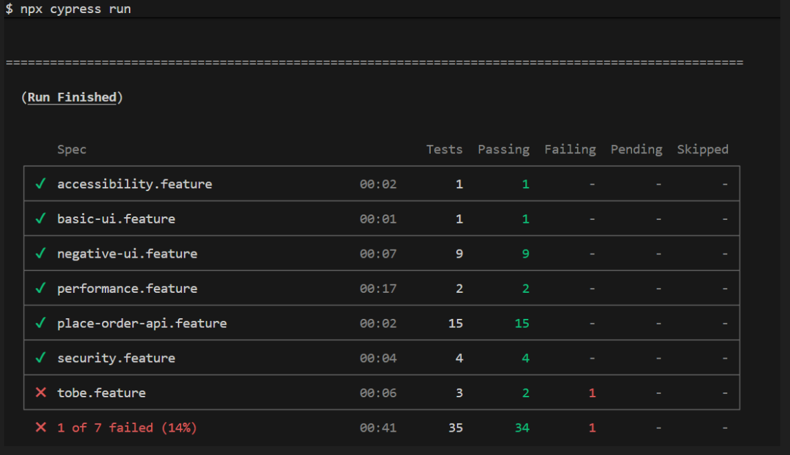

   !                            

#                                CODING EXERCISE

# SauceDemo Login Automation Framework

This project implements a test automation framework for testing the login functionality of the SauceDemo web application using Cypress with Cucumber (BDD).

## Overview

The framework automates login scenarios including positive, negative, security, accessibility, performance, and other edge cases. It follows best practices such as Page Object Model (POM), modular step definitions, and comprehensive reporting.

## Technologies and Application Used

- **Cypress**: End-to-end testing framework
- **Cucumber**: BDD framework for Gherkin syntax
- **JavaScript/Node.js**: Programming language
- **Mochawesome**: Test reporting
- **Git**: Version control
- Application Under Test : https://www.saucedemo.com/
- API Under Test : https://petstore.swagger.io/#/store/placeOrder
## Project Structure

```
cypress/
├── e2e/                          # Feature files (BDD scenarios)
│   ├── accessibility.feature     # Keyboard navigation tests
│   ├── basic.feature             # Basic login functionality
│   ├── place-order-api.feature   # API positive and negatove tests
│   ├── negative.feature          # Advanced security features
│   ├── tobe.feature              # Negative login scenarios
│   ├── performance.feature       # Performance tests
│   └── security.feature          # Security vulnerability tests
├── fixtures/                     # Test data
├── pages/                        # Page Object Model classes
│   └── authPage.js               # Authentication page methods
├── reports/                      # Test reports
├── screenshots/                  # Screenshots on failure
├── support/
│   ├── step_definitions/         # Step definition files
│   │   ├── accessibility.steps.js
│   │   ├── basic.steps.js
│   │   ├── common.steps.js       # Shared steps
│   │   ├── place-order-api.steps.js
│   │   ├── tobe.steps.js
│   │   ├── negative.steps.js
│   │   ├── performance.steps.js
│   │   └── security.steps.js
│   └── utils/                    # Utility functions
└── videos/                       # Test execution videos
```

## Setup Instructions

### Prerequisites

- Node.js (v14 or higher)
- npm or yarn

### Installation

1. Clone the repository:
   ```bash
   git clone <repository-url>
   cd SauceDemo-login-auto
   ```

2. Install dependencies:
   ```bash
   npm install
   ```

3. Install Cypress (if not included):
   ```bash
   npm install cypress --save-dev
   ```
4. Install npx:
   ```bash
   npm install npx
   ```

### Running Tests

1. Open Cypress Test Runner:
   ```bash
   npx cypress open
   ```

2. Run all tests headlessly:
   ```bash
   npx cypress run
   ```

3. Run specific feature:
   ```bash
   npx cypress run --spec "cypress/e2e/basic.feature"
   ```

4. Run with browser:
   ```bash
   npx cypress run --headed --browser chrome
   ```
5. Run Basic Sauce Demo UI and Pet Store API tests:
   ```bash
   npx cypress run --spec cypress/e2e/ --env TAGS='@basicUIAPI' --headed --browser chrome


6. Run Basic Sauce Demo UI:
   ```bash
   npx cypress run --spec cypress/e2e/ --env TAGS='@ui' --headed --browser chrome

7. Run Basic Pet Store API tests:
   ```bash
   npx cypress run --spec cypress/e2e/ --env TAGS='@api' --headed --browser chrome

8. Run Basic Pet Store API tests:
   ```bash
   npx cypress run --spec cypress/e2e/ --env TAGS='@smoke' --headed --browser chrome

### Execution Summary Report

### Generating Reports

Reports are automatically generated in `cypress/reports/` using Mochawesome.

To merge reports:
```bash
npx marge mochawesome-report-merged.json --reportDir cypress/reports/custom-reports --reportTitle 'Test Results'
```
You can refer below folder for HTML reports:
   SauceDemo-login-auto\cypress\reports\custom-reports
You can refer package.json and use various command(self-explanatory-names) :
  ex:  'npm run command-name-from-packagedotjson'

npx mochawesome-merge cypress/reports/*.json > mochawesome-report-merged.json
npx marge mochawesome-report-merged.json --reportDir cypress/reports/custom-reports --reportTitle 'Test Results'

Example HTML:
C:\Automation\Cypress\HMCTS\saucedemo-login-auto\mochawesome-report-merged.json

Cypress-CLoud reports:
npx cypress run --record --key <<proj-key>>
https://cloud.cypress.io/projects/gt5ztm/runs/1/overview?roarHideRunsWithDiffGroupsAndTags=1

## Test Scenarios

### Positive Scenarios
  Sauce Demo UI
- Successful user login via Sauce Demo UI
- Products verification to confirm user loggedin
   Pet Store API
- Successful order creation using possible inputs
- Retrieve an order by id
- Delete an existing order by id

### Negative Scenarios
Sauce Demo UI
- Empty username/password
- Invalid credentials
- Special characters
- International characters
- Boundary value analysis
- Account lockout
Pet Store API
- Duplicate order creation
- Orders created with invalid input parameters/fields
- Invalid order creation
- Retrieving Non existent order id
- Order created with malformed JSON


### Security Scenarios
- SQL injection attempts
- XSS attacks
- CSRF protection
- Session persistence after cache clear

### Accessibility Scenarios
- Keyboard navigation for login

### Performance Scenarios
- Rapid typing response time

### Other Scenarios
- Rate limiting
- MFA simulation
- API login

## Design Choices

### Page Object Model (POM)
- Centralized element selectors and methods in `authPage.js`
- Improves maintainability and reduces code duplication
- Easy to update UI changes in one place

### BDD with Cucumber
- Gherkin syntax for readable test scenarios
- Separation of test logic from step definitions
- Supports non-technical stakeholders

### Modular Step Definitions
- Common steps in `common.steps.js` for shared functionality
- Feature-specific steps in separate files
- Reduces redundancy and improves organization

### Test Data Management
- Fixtures for static data
- Dynamic user generation (synthetic test data) for unique test data

### Reporting and Logging
- Mochawesome for detailed HTML/JSON reports
- Cypress logs for debugging
- Screenshots and videos on failure

### Best Practices
- Proper waits and assertions
- Exception handling
- Version control with Git
- Clean, readable code with comments
- Custom Commands, utils and fixtures for maintenance
- Setup and Teardown to execute the tests independently


## Configuration

- `cypress.config.js`: Cypress configuration
- `package.json`: Dependencies and scripts
- Environment variables for sensitive data (e.g., default credentials)

## Potential Improvements

Given more time, I would:
- Implement additional advanced scenarios such as scenarios part of 'tobe.feature'
- USe fixtures and Custom commands to make framework better maintainable,scalable.
- Enhance Cross browser testing (for now we can use 'npm run runMultiBrowser' from package.json)
- Add Sauce Demo API testing integration, mockup and contract testing.
- Implement parallel test execution
- Add data-driven testing with CSV/JSON
- Integrate with CI/CD pipelines (Jenkins)
- Add cross-browser testing
- Implement custom commands for reusability
- Add database verification for backend tests
- Enhance error handling and retry mechanisms
- Add performance monitoring and metrics
- Implement test data factories for complex scenarios
- Containerized Deployment: Setup test environments from the scratch using Docker,K8s & Terraform and run the tests in brand new environments
- Integrate Slack OR MS Teams for better communication


## Troubleshooting

- Ensure the SauceDemo application is accessible
- Check network connectivity for external dependencies
- Verify Node.js version compatibility
- Clear Cypress cache if issues persist: `npx cypress cache clear`

## Contributing

1. Fork the repository
2. Create a feature branch
3. Make changes and add tests
4. Run tests and ensure they pass
5. Submit a pull request

## License

This project is for demonstration purposes as part of a technical assessment.